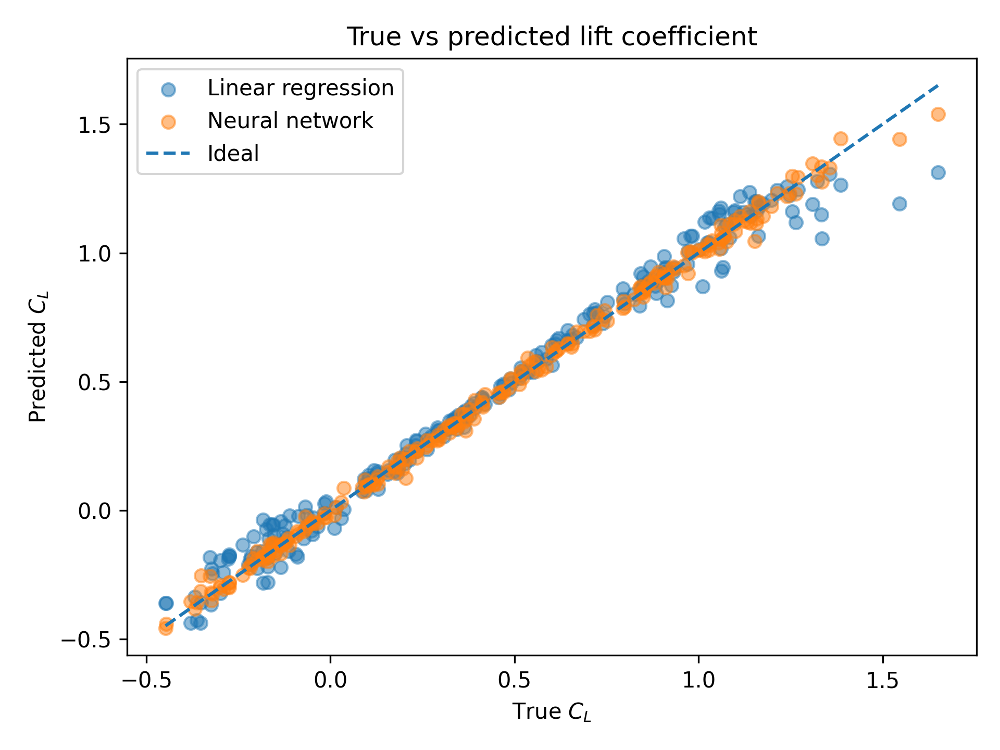
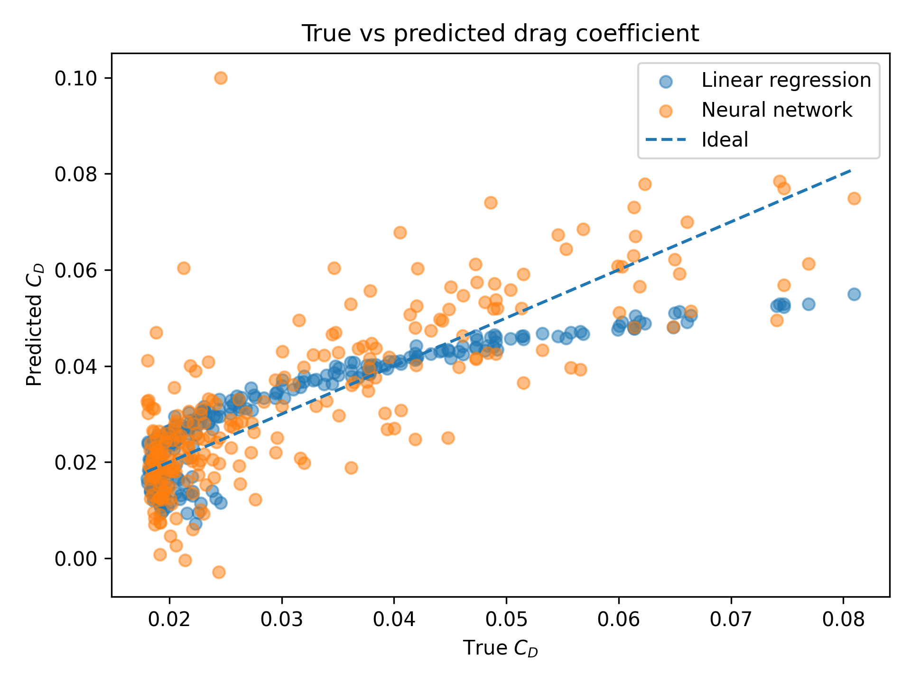

# Machine Learning for Aircraft Ground-Effect Aerodynamics

This project is a small demonstration of how basic machine-learning models can be applied to an aerospace problem: predicting lift and drag coefficients for a finite wing in ground effect.

I use a simple, physics-inspired aerodynamic model to generate a synthetic dataset of lift (`C_L`) and drag (`C_D`) for different flight conditions and wing geometries, then train and compare:

- A **linear regression** baseline.
- A small **feedforward neural network** (multi-layer perceptron) implemented as a multi-output regressor.

The goal is not to replace CFD, but to show in a clear and reproducible way how machine learning can be integrated into an aerospace workflow for modelling and design.

---

## 1. Problem setup

When a wing flies close to the ground, its aerodynamic characteristics change: lift generally increases and induced drag is reduced. Accurately capturing this *ground-effect* behaviour is important, especially during take-off and landing.

In this project I model:

- **Inputs (features)**  
  - `h_c` – height-to-chord ratio \( h/c \)  
  - `alpha_deg` – angle of attack in degrees  
  - `Re_million` – Reynolds number (scaled by \(10^6\))  
  - `AR` – wing aspect ratio (6, 9, or 12)

- **Outputs (targets)**  
  - `C_L` – lift coefficient in ground effect  
  - `C_D` – drag coefficient in ground effect  

The synthetic aerodynamic model combines a thin-airfoil-style lift curve with simple ground-effect corrections for lift and induced drag. This gives me a controlled environment where the true input–output relationship is known but still nonlinear.

---

## Experiment: Data-Driven Ground-Effect Aerodynamics

The experiment is basically:

> *Can simple ML models learn the lift and drag behaviour of a finite wing in ground effect?*

To test this:

1. Generate a synthetic dataset using the analytical model.
2. Train two regression models:
   - Linear regression.
   - A small neural network.
3. Compare their performance and see where ML actually helps and where it doesn’t.

The idea is to show how model design choices (e.g. architecture, target scaling) affect both accuracy and physical plausibility.

---

### Dataset generation

The dataset is generated using a simple analytical ground-effect model that combines:

- Thin-airfoil theory for lift out of ground effect.
- A finite-wing induced-drag model.
- Parametric corrections for increased lift and reduced induced drag near the ground.

Each sample is defined by:

- `h_c` – height-to-chord ratio \(h/c \in [0.1, 3.0]\)
- `alpha_deg` – angle of attack \(\alpha \in [-4^\circ, 12^\circ]\)
- `Re_million` – Reynolds number scaled by \(10^6\), spanning roughly 0.5–5.0
- `AR` – wing aspect ratio, chosen from \(\{6, 9, 12\}\)

The outputs (targets) are:

- `C_L` – lift coefficient in ground effect  
- `C_D` – drag coefficient in ground effect  

The final CSV file (`ground_effect_dataset.csv`) contains **1200 samples** (400 per aspect ratio). A quick summary:

- \(C_L \in [-0.51, 1.69]\), mean ≈ 0.40  
- \(C_D \in [0.018, 0.081]\), mean ≈ 0.030  

These values make sense for a finite wing at moderate angles of attack, with realistic drag levels. The coverage of \(h/c\), \(\alpha\), Reynolds number and aspect ratio is fairly broad, so it’s a decent regression problem for testing simple surrogates.

---

### Model configurations

I train two models on the same dataset using an 80/20 train–test split.

#### Linear regression baseline

- Pipeline: `StandardScaler` → `LinearRegression`
- Learns a global linear mapping from the four input features to both outputs (`C_L`, `C_D`).

This is a natural starting point because the synthetic lift model is almost linear in the features, and even the drag model is not too complicated.

#### Neural network surrogate (improved configuration)

I originally tried a single multi-output neural network trained jointly on `C_L` and `C_D`. That turned out badly for drag: because `C_L` is roughly an order of magnitude larger than `C_D`, the loss was dominated by lift, and the network basically “ignored” drag, giving large scatter and even negative drag values.

To fix this, the final neural model uses:

- `StandardScaler` on inputs.
- `MultiOutputRegressor(MLPRegressor)`, so **each target has its own MLP**, which avoids the scale-imbalance issue.
- MLP hyperparameters:
  - Hidden layers: `(64, 32)`
  - Activation: ReLU  
  - Solver: Adam  
  - `alpha = 1e-3` (L2 regularisation)
  - `max_iter = 5000`
  - `early_stopping = True`, `n_iter_no_change = 20`

This setup gave a much more stable neural surrogate, especially for `C_D`, with physically reasonable predictions.

---

### Quantitative results (`metrics.csv`)

Model performance is stored in `results/metrics.csv` as MAE and \(R^2\) for each target and split. On the **test set**:

- **Lift coefficient \(C_L\)**  
  - Linear regression:  
    - MAE ≈ **0.0457**  
    - \(R^2 \approx 0.983\)  
  - Neural network:  
    - MAE ≈ **0.0176**  
    - \(R^2 \approx 0.998\)  

  Both models do extremely well on lift, but the neural network roughly halves the MAE and pushes \(R^2\) very close to 1. This is what I’d expect, since the synthetic lift law has some mild nonlinearities that the MLP can capture.

- **Drag coefficient \(C_D\)**  
  - Linear regression:  
    - MAE ≈ **0.0056**  
    - \(R^2 \approx 0.77\)  
  - Neural network:  
    - MAE ≈ **0.0077**  
    - \(R^2 \approx 0.47\)  

  Typical `C_D` values are around 0.03, so these errors are on the order of 15–25% relative error. The key point is that the **linear model actually generalises better** on drag than the neural network. The NN is slightly better on the training set but worse on the test set, which is a sign of overfitting.

**Commentary on the CSVs**

> The dataset CSV shows that the synthetic aerodynamic model produces sensible coefficients across the intended parameter ranges, with a realistic spread of lift and strictly positive drag. The metrics CSV confirms that linear regression already achieves very high accuracy for \(C_L\) and reasonable accuracy for \(C_D\), while the improved neural network brings a clear gain for lift but not for drag. This is a nice example of how small ML surrogates can work well for some quantities (here, lift) but may not always outperform simpler models for others (drag), especially when the underlying relationship is fairly simple.

---

### True vs predicted figures

Two scatter plots give a visual check of the model behaviour on the test set.

#### Lift coefficient \(C_L\)

> **Figure 1** compares true and predicted lift coefficients \(C_L\) for the test samples. Both the linear regression and the neural network produce points that lie very close to the 1:1 reference line, which means the main lift behaviour is captured well across the range of angle of attack, height ratio and aspect ratio. The scatter around the diagonal is small and doesn’t show an obvious bias. The neural-network predictions form an even tighter band around the line than the linear model, especially at the highest and lowest \(C_L\) values, which suggests it is picking up the small nonlinear effects in the synthetic model.

#### Drag coefficient \(C_D\) (improved neural network)

> **Figure 2** shows the equivalent plot for the drag coefficient \(C_D\). The linear regression model (blue markers) follows the 1:1 line with a moderate, roughly symmetric spread, which is reasonable given the simple drag formulation (profile + induced drag). The neural network (orange markers), using the improved multi-output configuration, now follows the same upward trend and no longer produces the very scattered or negative values that appeared in the original setup. Its scatter is still somewhat larger than that of the linear baseline—consistent with the lower test-set \(R^2\)—but the predictions remain centred around the diagonal and reproduce the curvature of the drag relationship at low \(C_D\). This shows that the revised training strategy (separate MLP per target, early stopping and regularisation) made the drag surrogate physically plausible, even if the linear model is ultimately more robust here.

#### Original neural-network drag behaviour (optional, for discussion)

In an earlier version (not used for the final results), I trained a single multi-output MLP on both `C_L` and `C_D`. The drag predictions from that model were very noisy, with lots of scatter and even negative drag values. This was mainly due to the scale difference between lift and drag: the loss was dominated by `C_L`, so the network didn’t “care” enough about `C_D`. Switching to `MultiOutputRegressor` with one MLP per target, plus early stopping and a bit of regularisation, fixed that issue and led to the improved behaviour seen in Figure 2.

---

## References

1. Hall, S. R. (2015). *Introduction to Aerodynamics* (MITx 16.101x/16.101). MIT OpenCourseWare / edX lecture notes.  
   Available at: https://ocw.mit.edu and via course PDF (e.g. mitx_compressed.pdf).

2. Mason, W. H. et al. (2019). *Aerodynamics and Aircraft Performance, 3rd ed.* Virginia Tech / LibreTexts open textbook.  
   Available at: https://pressbooks.lib.vt.edu/aerodynamics/

3. EG-296 Flight Mechanics Lecture Notes. *Flight Mechanics (EG-296)*, Aerostudents.  
   Includes treatment of finite-wing induced drag and ground effect via a non-dimensional height factor \(\varphi(h/b)\).  
   Available at: https://www.aerostudents.com .

4. Zerihan, J., & Zhang, X. (2000). *Aerodynamics of a Single Element Wing in Ground Effect*. Journal of Aircraft, 37(6), 1058–1064.  
   An experimental and numerical study of a finite wing near the ground, showing how lift and drag vary with height-to-chord and angle of attack.  
   Open-access versions are available via the University of Southampton repository and other mirrors.

5. Ghafoor, A. (2015). *Wing in Ground Effect Vehicle: Modelling and Control* (MSc thesis). Middle East Technical University.  
   Provides an overview of wing-in-ground-effect vehicles, modelling approaches, and control strategies, including the influence of height and aspect ratio.  
   Available at: https://open.metu.edu.tr.
